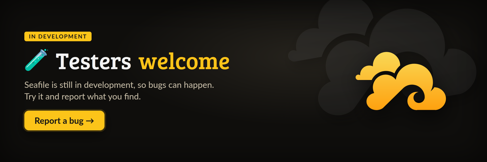
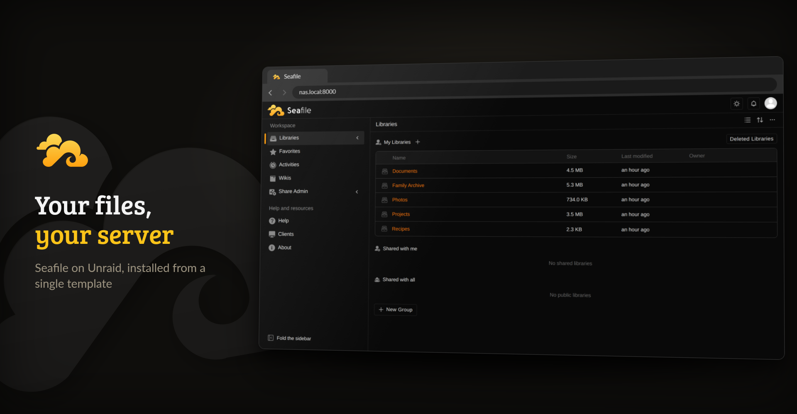
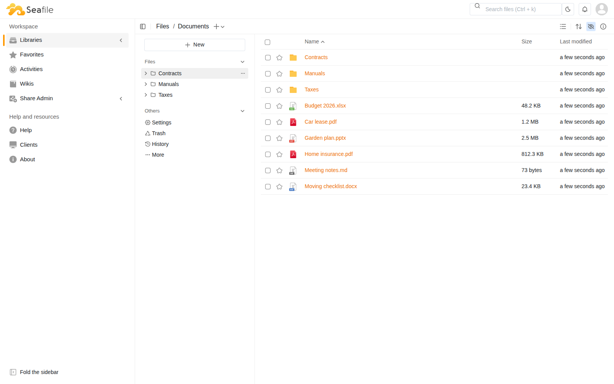
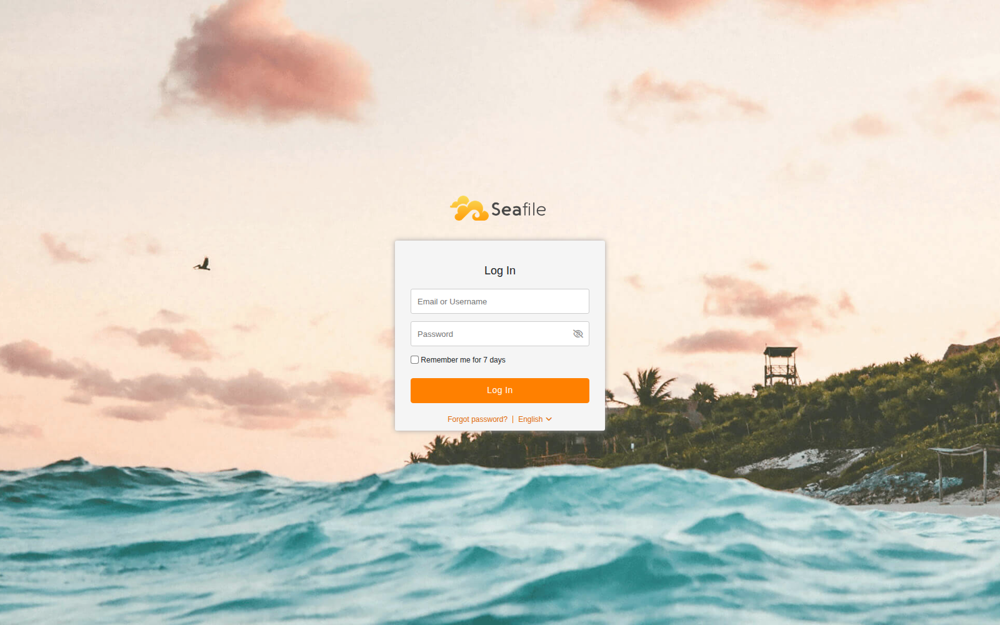

<p align="center">
  <picture>
    <source media="(prefers-color-scheme: dark)" srcset="https://raw.githubusercontent.com/junkerderprovinz/seafile/main/.github/assets/banner-dark.png">
    
  </picture>
</p>

<p align="center">
  <a href="https://github.com/junkerderprovinz/seafile/actions/workflows/build.yml"></a>&nbsp;
  <a href="https://github.com/junkerderprovinz/seafile/actions/workflows/lint.yml"></a>&nbsp;
  <a href="https://hub.docker.com/r/junkerderprovinz/seafile"></a>&nbsp;
  <a href="https://github.com/junkerderprovinz/seafile/pkgs/container/seafile"></a>&nbsp;
  <a href="https://www.seafile.com"></a>&nbsp;
  <a href="https://unraid.net"></a>&nbsp;
  <a href="LICENSE"></a>
</p>

<br>

<p align="center">
The official <b>Seafile</b> server, installable on Unraid from a single template. It creates its own
secrets on the first start, and it can run MariaDB, Redis and the notification server inside the
same container when you have none of your own.
</p>

<p align="center">
  <a href="https://github.com/junkerderprovinz/seafile/issues/new/choose"></a>
</p>

<br>

<p align="center">
A one-knight job: I build it, keep it running, work through the issues and add what people ask for, until nothing is missing. It is free, with no accounts, no telemetry, no ads and no paid tier. No asterisk anywhere. Nothing readable ever leaves your own walls. Forged on evenings and weekends, with heart and stubbornness.
</p>

<p align="center">
If it has earned a place on your server or computer, toss a coin to your knight: it helps cover the costs and keeps the project alive. It also makes this knight's heart beat a little faster. Three ways below, whichever suits you.
</p>

<br>

<p align="center">
  <a href="https://buymeacoffee.com/junkerderprovinz"></a>
  &nbsp;
  <a href="https://www.paypal.com/donate/?hosted_button_id=76FVV52TKXTUS"></a>
  &nbsp;
  <a href="https://junkerderprovinz.github.io/junkerderprovinz/"></a>
</p>

<br>

## Table of Contents

1. [Overview](#1-overview)
2. [Screenshots](#2-screenshots)
3. [Quick Start](#3-quick-start)
4. [Configuration](#4-configuration)
5. [Built-in or External Services](#5-built-in-or-external-services)
6. [Switching from Another Seafile Template](#6-switching-from-another-seafile-template)
7. [Reverse Proxy](#7-reverse-proxy)
8. [Updating](#8-updating)
9. [Troubleshooting](#9-troubleshooting)
10. [Building Locally](#10-building-locally)
11. [License](#11-license)
12. [How AI is used here](#12-how-ai-is-used-here)
13. [Support this project](#13-support-this-project)

<br>

## 1. Overview

[Seafile](https://www.seafile.com) is a file sync and share server with desktop and mobile clients, libraries you can encrypt on the client, and built-in wikis. Its official image [`seafileltd/seafile-mc`](https://hub.docker.com/r/seafileltd/seafile-mc) is built for Docker Compose: it expects MariaDB, Redis and, if you want live updates in the clients, a notification server, each as a container of its own on a shared network, plus a JWT key you generate by hand. On Unraid that means four templates, a custom Docker network and a long guide before the first login.

This image is the official one with a small layer in front of it:

- On the first start it generates the JWT key, the database password and, if you leave that field empty, the admin password. All of them go into `secrets.env` in your appdata folder.
- MariaDB and Redis can run inside the container. Both are off by default, because most Unraid servers already have a MariaDB. Switch one on and it starts next to Seafile, listening only on `127.0.0.1`.
- The notification server is included as well. With it switched on, the desktop and mobile clients learn about a change when it happens instead of asking for it on a timer.
- If the database or Redis host is missing, the container stops with one line saying what to set, instead of starting into a "Page unavailable".
- On shutdown, Seafile stops before the database it writes to.

The official scripts in the image still do the rest, including the first-run setup and the upgrades between Seafile versions. The folder layout under `/shared` is the same as in the official image, so a setup made with it keeps working here.

<br>

## 2. Screenshots

<p align="center">
  
  <br><em>Your libraries, each synced and shared on its own.</em>
</p>

<br>

<p align="center">
  
  <br><em>Inside a library: folders, documents and the file tree on the left.</em>
</p>

<br>

<p align="center">
  
  <br><em>The sign-in page, ready a minute after the first start.</em>
</p>

<br>

## 3. Quick Start

1. Install **Seafile** from Community Applications.
2. Set **Server hostname** to the address your clients will use, for example `192.168.1.10:8000` or `seafile.example.com`. Leave out `http://`.
3. Pick your services:
   - **No MariaDB or Redis yet?** Set **Built-in MariaDB** and **Built-in Redis** to `true` and leave their host fields empty.
   - **MariaDB already running?** Enter its host and its root password. The root password is only used once, to create the three Seafile databases and the `seafile` user, and you can remove it afterwards.
4. Enter an **Admin email**. Leave the admin password empty to get a generated one.
5. Start the container and open the log. The first start takes about a minute. It is ready when the log says `Seahub is started`. If the password was generated, the log names it, and it is also in `secrets.env`.
6. Open `http://[IP]:8000` and sign in.

With `docker run`:

```bash
docker run -d --name seafile \
  -p 8000:80 \
  -v /mnt/user/appdata/seafile:/shared \
  -e SEAFILE_SERVER_HOSTNAME=192.168.1.10:8000 \
  -e INIT_SEAFILE_ADMIN_EMAIL=you@example.com \
  -e BUILTIN_MARIADB=true \
  -e BUILTIN_REDIS=true \
  junkerderprovinz/seafile:latest
```

<br>

## 4. Configuration

| Variable | Default | What it does |
| --- | --- | --- |
| `SEAFILE_SERVER_HOSTNAME` | | Required. The host and port clients use, without the protocol. |
| `SEAFILE_SERVER_PROTOCOL` | `http` | `https` when Seafile sits behind a reverse proxy with TLS. |
| `INIT_SEAFILE_ADMIN_EMAIL` | `me@example.com` | The admin account created on the first start. |
| `INIT_SEAFILE_ADMIN_PASSWORD` | generated | Only read on the first start. |
| `BUILTIN_MARIADB` | `false` | `true` runs MariaDB inside the container, with its data in `/shared/mariadb`. |
| `SEAFILE_MYSQL_DB_HOST` | | Your MariaDB or MySQL host. Ignored with the built-in MariaDB. |
| `SEAFILE_MYSQL_DB_PORT` | `3306` | |
| `SEAFILE_MYSQL_DB_USER` | `seafile` | |
| `SEAFILE_MYSQL_DB_PASSWORD` | generated | Password of that user. |
| `INIT_SEAFILE_MYSQL_ROOT_PASSWORD` | | Root password of your MariaDB, used once to create the databases. |
| `SEAFILE_MYSQL_DB_CCNET_DB_NAME` | `ccnet_db` | |
| `SEAFILE_MYSQL_DB_SEAFILE_DB_NAME` | `seafile_db` | |
| `SEAFILE_MYSQL_DB_SEAHUB_DB_NAME` | `seahub_db` | |
| `BUILTIN_REDIS` | `false` | `true` runs Redis inside the container. It only holds a cache, nothing is written to disk. |
| `REDIS_HOST` | | Your Redis host. Ignored with the built-in Redis. |
| `REDIS_PORT` | `6379` | |
| `REDIS_PASSWORD` | | |
| `ENABLE_NOTIFICATION_SERVER` | `false` | `true` starts the notification server and serves it under `/notification`. |
| `NOTIFICATION_SERVER_URL` | derived | Only needed when clients reach Seafile under another address than the hostname. |
| `JWT_PRIVATE_KEY` | generated | Shared by Seafile and its add-ons. Set it yourself only when you run SeaDoc. |
| `ENABLE_SEADOC` | `false` | `true` turns on the SeaDoc editor, which runs as a separate container. |
| `SEADOC_SERVER_URL` | | The address of that SeaDoc container. |
| `TZ` | | Unraid fills this in. It sets Seafile's time zone too. |

All other variables of the official image work as documented in the [Seafile manual](https://manual.seafile.com/latest/setup/setup_ce_by_docker/).

Generated values are written once to `/shared/secrets.env` and read from there on every start. A value you set in the template always wins over the file.

<br>

## 5. Built-in or External Services

**MariaDB.** If you already run one, use it: one database server is easier to back up and to watch than several. The built-in MariaDB is for servers that have none. It keeps its data in `/shared/mariadb`, so it moves and gets backed up together with the rest of Seafile. Do not switch an existing installation from one to the other. Seafile's data lives in that database, and the switch gives it an empty one.

If you would rather not hand the root password to the container, create the three databases and the user yourself, grant the user all rights on them and set `USE_EXISTING_DB=1` as an extra variable. Then the root password is not needed.

**Redis.** Seafile only keeps a cache in Redis, so there is little reason to run a separate one for it. Both work.

**Notification server.** Without it the clients check for changes on a timer. With it they hear about a change as soon as it happens. It needs nothing besides the switch.

<br>

## 6. Switching from Another Seafile Template

The layout under `/shared` is the one from the official image, which the other Seafile templates in Community Applications use as well. To switch:

1. Stop the old Seafile container and back up its folder and its database.
2. Install this template and point **Data** at the same folder.
3. Copy over the hostname, the database host, user and password, the Redis host and the `JWT_PRIVATE_KEY`. Keep **Built-in MariaDB** off, your data is in the database you already have.
4. Start it. Seafile finds the existing data and skips the setup.

Seafile 14 cannot go back to 13. When the old container still runs Seafile 13, the database is upgraded on the first start, so take the backup first.

<br>

## 7. Reverse Proxy

Point the proxy at the container's port 80, set `SEAFILE_SERVER_PROTOCOL=https` and set `SEAFILE_SERVER_HOSTNAME` to the public name, for example `seafile.example.com`. The proxy has to pass WebSocket connections for `/notification` when the notification server is on, and it should allow large uploads, since nginx inside the container already does.

<br>

## 8. Updating

Updates come as new images. Seafile runs its own upgrade scripts when it finds a newer version than the one that created your data, so updating means pulling the image and starting the container.

This image currently ships **Seafile 14.0.8**, which upstream still labels as testing. Once Seafile 14 is released as stable, the image moves to it. Back up your appdata folder and database before updating, because Seafile cannot be downgraded.

<br>

## 9. Troubleshooting

**The container stops right after starting.** Look at the last lines of the log. A line starting with `[prepare]` names the setting that is missing.

**"Page unavailable" after signing in.** Seafile cannot reach its cache. Check `REDIS_HOST`, or switch on the built-in Redis.

**I lost the generated admin password.** It is in `secrets.env` in your appdata folder. If you changed it since, reset it in the container console with `/opt/seafile/seafile-server-latest/reset-admin.sh`.

**Uploads fail behind a proxy.** The proxy limits the request size. In Nginx Proxy Manager, add `client_max_body_size 0;` to the proxy host's advanced settings.

**Desktop clients cannot sync, the browser works.** `SEAFILE_SERVER_HOSTNAME` has to be the address the clients reach the server under, including the port.

<br>

## 10. Building Locally

```bash
git clone https://github.com/junkerderprovinz/seafile.git
cd seafile
docker build -t seafile:local .
```

The startup layer lives in `rootfs/`: `etc/my_init.d/00_prepare.sh` runs before the official startup scripts, and `etc/sv/` holds the optional services.

<br>

## 11. License

The scripts and configuration in this repository are licensed under the [GNU Affero General Public License v3.0](LICENSE). Seafile itself is released by Seafile Ltd. under its own licenses; the Community Edition server is AGPL-3.0 as well. This is an independent packaging for Unraid and is not affiliated with Seafile Ltd.

<br>

## 12. How AI is used here

One knight builds this, and AI is one of the tools I work with, the same way I work with an editor or a compiler. It helps me write code and documentation and it checks my work, and that saves me a good many evenings. It does not make the decisions, though. I read and understand everything before it ships, and if something here breaks, that is on me and not on the tool.

You do not have to take my word for it. The code is open and every release note is written by hand. The issue tracker shows how problems actually get handled, including the ones I got wrong the first time. If you find something that is not right, open an issue and I will look at it.

<br>

## 13. Support this project

Questions? Check the [support thread](https://forums.unraid.net/topic/200798-support-junkerderprovinz-seafile-14/). Bugs, ideas or feature requests? Please [open a GitHub issue](https://github.com/junkerderprovinz/seafile/issues).

A one-knight job: I build it, keep it running, work through the issues and add what people ask for, until nothing is missing. It is free, with no accounts, no telemetry, no ads and no paid tier. No asterisk anywhere. Nothing readable ever leaves your own walls. Forged on evenings and weekends, with heart and stubbornness.

If it has earned a place on your server or computer, toss a coin to your knight: it helps cover the costs and keeps the project alive. It also makes this knight's heart beat a little faster. Three ways below, whichever suits you.

<p align="center">
  <a href="https://buymeacoffee.com/junkerderprovinz"></a>
  &nbsp;
  <a href="https://www.paypal.com/donate/?hosted_button_id=76FVV52TKXTUS"></a>
  &nbsp;
  <a href="https://junkerderprovinz.github.io/junkerderprovinz/"></a>
</p>
